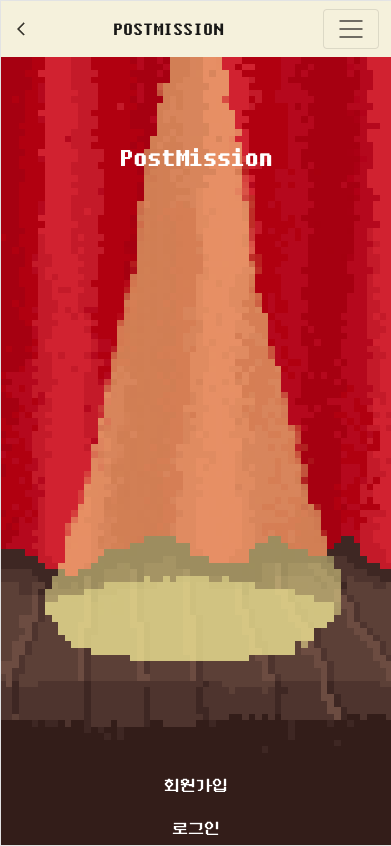

# Postmission Front

[move to backend](https://github.com/post-mission/backend)

- 서버 관련 내용은 backend respository에 정리 돼 있습니다.


## Contents

1. [Description](#Description)
2. [Getting-Started](#Getting-Started)
3. [Overview](#Overview)
4. [Development](#Development)
4. [Issues](#Issues)


## Description

공연에서는 배우가 주인공입니다. 관객들은 배우의 연기를 보며 다양한 감정을 느끼고 공유합니다.


`INTERMISSION`은 공연 중간에 있는 쉬는시간을 의미합니다.

이 시간을 통해 감정을 정리하고, 남은 시간을 위한 에너지를 관객과 배우 모두가 충전합니다.


##### 공연이 끝난 후, `POSTMISSION`에서는, 여러분이 주인공입니다.

POSTMISSION은 `POST`와 `MISSION`을 합친 단어로, 

공연이 끝난 `후`, `포스트` 를 작성하며 생각을 정리하고 기록할 수 있습니다.

`미션`을 달성하면 트로피 및 캐릭터를 획득할 수 있습니다.


#### 저희 POSTMISSION은...

- 사용자 참여형
- 기록을 남기고 공유
- 비슷한 관심사를 가진 다른 사용자와의 소통
- 그런데 재미 요소를 곁들인


## Getting Started

#### Client

```bash
$ git clone https://github.com/post-mission/frontend.git
$ cd frontend
$ cd postmission_front
$ npm install
$ touch .env 
$ echo "REACT_APP_SERVER_URL="http://i6a302.p.ssafy.io:8080"" > .env
$ npm run start
```


## Overview

#### 인트로 화면


- 공연 시작 전, 모든 조명은 소등되며 관객들의 기대감은 높아집니다.
- 기호에 따라 ON/OFF 버튼을 통해 조명을 키고 끌 수 있으며
- 사용자의 참여가 본격화 되는 순간 화면은 밝아집니다.


#### 홈 화면

|  |  |
| --------------------------------------------- | ------------------------------------------- |

- 첫 회원가입 후, 캐릭터가 설정돼있지 않은 상태에서는 홈 화면에 그림자 물체가 보입니다.
- 부캐 테스트를 통해 홈 화면에 보일 캐릭터를 획득할 수 있습니다.


#### 프로필 페이지

|  |  |
| ------------------------------------- | ------------------------------------- |

- 프로필 사진 업로드 및 닉네임/비밀번호를 수정할 수 있습니다.


#### 부캐 테스트

|  |  |
| ------------------------------------------------- | ----------------------------------------- |

- 테스트를 통해 나에게 맞는 뮤지컬 캐릭터를 획득할 수 있습니다.
- 획득한 캐릭터는 나의 부캐로 홈 화면에 보이게 됩니다.


#### 트로피

|  |  |
| ------------------------------------- | ------------------------------------- |

- 획득할 수 있는 트로피의 종류를 볼 수 있습니다.
- 미션을 달성하면 트로피를 받을 수 있습니다.


#### 티켓북

|  |  |
| --------------------------------------------------- | --------------------------------------------------- |

- 관람하거나 앞으로 관람하게 될 뮤지컬 후기를 작성할 수 있습니다.
- 날짜 순으로 정렬되며, 실시간 뮤지컬 검색이 가능합니다.
- 스포일러를 방지하기 위해 스포일러 유무 여부를 체크합니다.
- 작성한 후기는 공개 여부에 따라 게시판으로도 복사되어 다른 사람들과 소통할 수 있습니다.


#### 달력

|  |  |
| --------------------------------------- | --------------------------------------- |

- 티켓북을 달력 형식으로 볼 수 있습니다.
- 티켓북보다는 간단한 세부 정보를 보여줍니다.


#### 자유게시판


## Development


### Language & Tools


### Components


## Issues

- [류완수](./README.assets/rws.md)
- [위연주](./README.assets/yeonju.md)
- [윤혜구](./README.assets/une9.md)
